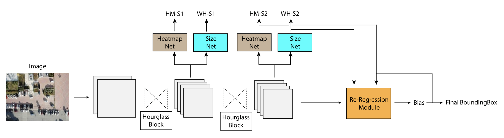

# RRNet - Re Regression Net for Object Detection in Drones Image

*Geo, Yu Zhang, Qingxuan LV, Shuo Wei, andd Xiaorui Wang*

This repo is created for ICCV Drones Detection 2019. We proposed RRNet, which is an anchor-free detector with a re-regression module.

## Architecture



## Demo


## Environment

- PyTorch 1.1.0
- python3+

## Setup

```bash
cd ext/nms && make && cd ..

# Prepare Drones dataset in 'data' folder.

# For Training RRNet
cp scripts/RRNet/train.py ./
python3 train.py

# For evaluation
cp scripts/RRNet/eval.py ./
python3 eval.py
```
